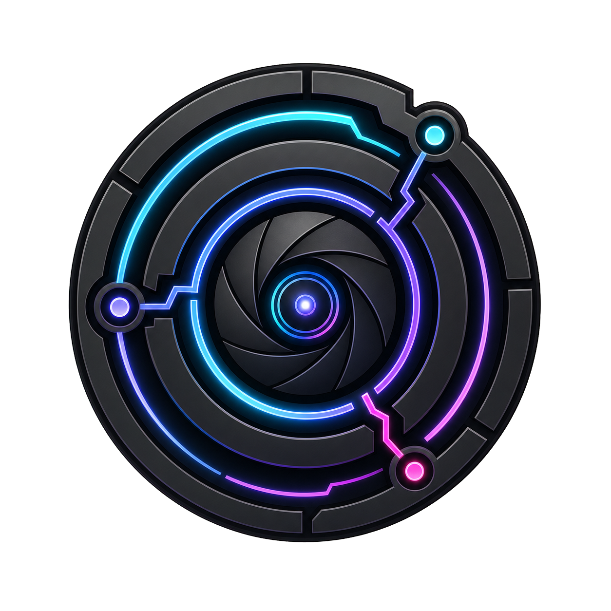

<div align="center">

  <h1>agentlens</h1>

  

  <p>Analyze, score, and improve your Claude Code subagents from their session logs.</p>

  [](https://opensource.org/licenses/MIT)
  [](https://www.python.org/)
  [](https://docs.astral.sh/uv/)
  [](https://github.com/Fission-AI/OpenSpec)
  [](http://makeapullrequest.com)

</div>

---

## What it is

You have a growing set of custom subagents (`.claude/agents/*.md`). Today there's no way to see, across many sessions, which agents perform well, which go off-track, and what to fix. Claude Code already records everything as JSONL under `.claude/projects/`. **agentlens** reads that data, scores each subagent run, and produces actionable fix proposals you can hand back to Claude Code.

It is a local CLI that turns raw session logs into:

- a **machine-readable handoff** for Claude to patch your agents, and
- a **well-designed report** for a human to read.

**What it is not:** a cost dashboard, a live monitor, or a hosted service. It runs on demand, locally, and is read-only against your `.claude/` directory.

## Design principles

1. **One data core, many thin renderers.** A dimensional SQLite store is the source of truth; terminal, markdown, HTML, and a future dashboard are all queries over it.
2. **Measured vs. modeled, kept separate.** Deterministic facts (what happened) are immutable and reproducible. LLM verdicts (how good it was) are subjective, versioned, and re-scoreable — they never mix in the same table.
3. **The killer output is the fix, not the score.** A single number invites gaming and hides the *why*. The product is per-session findings plus concrete fixes.

## Status

Early development. **Phase 0 + 1 are complete**: the CLI scaffold, the full SQLite dimensional schema, and the deterministic parser core that reads session logs into `fact_tool_event` + `dim_agent`. Scoring (the LLM judge) and the rendered reports are upcoming phases.

| Phase | Scope | State |
|---|---|---|
| 0 | Scaffold & contracts (CLI, schema DDL, verdict-JSON shape) | ✅ Done |
| 1 | Deterministic parser core (no LLM) | ✅ Done |
| 2 | Deterministic signals & aggregation (windows, deltas) | Planned |
| 3 | LLM judge (pluggable, `claude -p` backend, rubric v1) | Planned |
| 4 | Design system for the HTML report | Planned |
| 5 | Renderers (markdown, JSON, terminal, HTML) | Planned |

See [`docs/agentlens-design.md`](docs/agentlens-design.md) for the full design.

## Install & run

agentlens is a Python package managed with [uv](https://docs.astral.sh/uv/).

```bash
# Run without installing (once published)
uvx agentlens --help

# Or install for regular use
pipx install agentlens
```

## Usage

```bash
# Analyze a single session — the primitive everything builds on
agentlens session <session-id>
agentlens session --file path/to/agent-<id>.jsonl

# Aggregate rollup across sessions in a window (aggregation lands in Phase 2)
agentlens report --agent implementer --since 7d
```

The store lives at `~/.cache/agentlens/agentlens.db` by default. Override it with `--store <path>` or the `AGENTLENS_STORE` environment variable. agentlens never writes inside any `.claude/` directory.

## How it works

Four stages, each a thin layer over the previous:

```
.claude/projects/**/*.jsonl              (main sessions)     ─┐
.claude/projects/**/<sid>/subagents/
        agent-<agentId>.jsonl            (subagent runs)     ─┤
        agent-<agentId>.meta.json        (spawn sidecar)     ─┼──▶  PARSE  ──▶  store (SQLite)
.claude/agents/**/*.md                   (agent defs)        ─┘         │
                                                                        ├──▶  SCORE  (deterministic + LLM judge)
                                                                        └──▶  RENDER (terminal / markdown / json / html)
```

The store is a star schema that keeps grains separate so windows (date filters) and prior-window deltas (self-joins) stay trivial. The grain of the primary fact is a **single agent run** — one row per spawn, never an agent *type*.

## Development

Local development uses **uv** with a project virtual environment (`.venv`). See [`CLAUDE.md`](CLAUDE.md) for the full contributor workflow.

```bash
uv sync                 # create/refresh the .venv and install deps
uv run agentlens --help # run the CLI from the venv
uv run pytest           # tests
uv run ruff check       # lint
uv run mypy             # type-check (strict)
```

Non-trivial changes are proposed and tracked with [OpenSpec](https://github.com/Fission-AI/OpenSpec); Python follows the project's `python-engineering-standards`. Architectural decisions that bind future work live in [`docs/adr/`](docs/adr/).

## License

[MIT](https://opensource.org/licenses/MIT)
